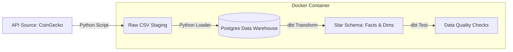

# Modern Data Stack: Crypto ELT Pipeline
An end-to-end ELT (Extract, Load, Transform) pipeline that ingests real-time cryptocurrency market data, warehouses it in PostgreSQL, and transforms it into a multidimensional Star Schema using dbt.

Built with software engineering best practices in mind: containerization, modularity, and automated data quality testing.

---

## Architecture
The pipeline follows a modular ELT pattern:



* **Ingestion (Extract):** A Python script fetches live market data (Price, Volume, Market Cap) for the top 50 cryptocurrencies via the CoinGecko API.
* **Storage (Load):** Raw API data is parsed, saved as CSV, then loaded into a PostgreSQL staging table (`raw_crypto_data`).
* **Transformation (Transform):** dbt (Data Build Tool) processes the raw data into a clean Star Schema optimized for analytics.
* **Orchestration:** Apache Airflow schedules and manages the dependency graph (DAG), ensuring tasks run in the correct order.
* **Quality Assurance:** Automated tests run after every transformation to ensure referential integrity and data validity.

---

## Tech Stack
| Component | Tool | Description |
| --- | --- | --- |
| **Orchestration** | Apache Airflow 2.9 | Manages the workflow DAG and task dependencies. |
| **Containerization** | Docker & Compose | Ensures the environment is reproducible and isolated. |
| **Transformation** | dbt Core | Handles data modeling (SQL), testing, and documentation. |
| **Warehouse** | PostgreSQL | Acts as the local Data Warehouse. |
| **Language** | Python 3.10 | Used for API extraction and custom operators. |

---

## Data Modeling
The project implements a **Dimensional Modeling** approach (Star Schema) to enable efficient historical analysis (OLAP concepts).

### Raw Layer
* `raw_crypto_data`: The landing zone for data as it arrives from the API.

### Marts (The Gold Layer)
* **`dim_coins` (Dimension):** Contains static information about cryptocurrencies (Symbol, Name).
  * *Tests:* Uniqueness on `coin_id`, Not Null constraints.


* **`fact_market_history` (Fact):** Contains high-velocity historical metrics (Price, Market Cap, 24h Volume).
  * *Tests:* Referential integrity checks (every `coin_id` must exist in `dim_coins`).


---

## Project Structure
```plaintext
crypto-elt-pipeline/
├── dags/                          # Airflow DAGs (Pipeline definitions)
│   └── crypto_pipeline.py         # Main DAG file
├── scripts/                       # Python scripts for EL steps
│   ├── extract.py                 # Fetches data from API
│   └── load.py                    # Loads data to Postgres
├── crypto_analytics/              # dbt project root
│   ├── models/                    # SQL Transformations
│   │   ├── staging/               # Cleaning raw data
│   │   └── marts/                 # Star Schema tables
│   ├── tests/                     # Custom data tests
│   └── dbt_project.yml            # dbt configuration
├── docker-compose.yaml            # Infrastructure definition
├── requirements.txt               # Python dependencies
└── README.md                      # Documentation

```

---

## How to Run
### Prerequisites
* Docker Desktop installed and running.
* Git installed.

### Step 1: Clone the Repository
```bash
git clone https://github.com/dan-fonseca/crypto-elt-pipeline.git
cd crypto-elt-pipeline
```

### Step 2: Launch the Infrastructure
We use Docker Compose to spin up Airflow (Webserver, Scheduler) and Postgres.
```bash
docker-compose up -d
```

*Wait approx. 30 seconds for the containers to initialize.*

### Step 3: Access Airflow
1. Open your browser to `http://localhost:8080`.
2. Login with default credentials:
* **Username:** `admin`
* **Password:** `admin`


### Step 4: Run the Pipeline
1. Find the DAG named `crypto_market_data_pipeline`.
2. Toggle the switch to **Unpause** (Blue).
3. Click the **Play Button** under actions and select **Trigger DAG**.

### Step 5: Verify Results
Once the DAG tasks turn **Dark Green** (Success), you can query the Data Warehouse to see the modeled data:

```bash
docker exec -it crypto-elt-pipeline-postgres-1 psql -U airflow -d airflow -c "SELECT * FROM public.fact_market_history LIMIT 5;"

```

---

## Data Quality
This pipeline treats data quality as a priority. Transformations do not simply "run"; they are tested.

To manually run the test suite inside the container:

```bash
# This mimics the command Airflow runs automatically
docker exec -it transit-pipeline-airflow-scheduler-1 bash -c "pip install dbt-postgres && cd /opt/airflow/dbt && dbt test --profiles-dir ."
```

---

## Future Improvements
* **Dashboarding:** Connect Metabase or Superset to Postgres to visualize the price trends.
* **Incremental Loading:** Optimize the dbt models to process only new data (Incremental Strategy) rather than full refreshes.
* **Cloud Migration:** Adapt the docker-compose setup to run on AWS ECS or Google Cloud Run.

---
